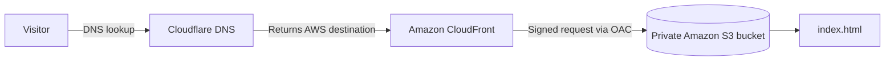

# dague.vip AWS CloudFront Portfolio

This repository contains the source and documentation for **dague.vip**, my personal cloud portfolio and one of my first hands-on AWS infrastructure projects.

I built the site to get practical experience with the pieces behind a secure static website: object storage, CDN delivery, private origin access, TLS certificates, DNS, and troubleshooting when those pieces do not behave the way I expect.

## Architecture



Cloudflare is used as the **authoritative DNS provider only**. Cloudflare proxying is disabled for the website records, so web traffic goes directly to Amazon CloudFront after DNS resolution.

## Components

| Component | Purpose |
| --- | --- |
| Amazon S3 | Stores the static site files in a private bucket |
| Amazon CloudFront | Global CDN and public web delivery layer |
| Origin Access Control (OAC) | Allows CloudFront to read the private S3 objects |
| AWS Certificate Manager (ACM) | Provides the TLS certificate used by CloudFront |
| Cloudflare DNS | Hosts authoritative DNS for `dague.vip` |
| GoDaddy | Domain registrar |
| GitHub | Stores source and project documentation |

## Request flow

1. A visitor requests `dague.vip`.
2. Cloudflare answers DNS and directs the hostname to CloudFront.
3. The visitor connects directly to CloudFront over HTTPS.
4. CloudFront maps `/` to the default root object `index.html`.
5. CloudFront sends a signed request to the private S3 origin using OAC.
6. S3 returns the object to CloudFront.
7. CloudFront serves the content to the visitor.

The S3 bucket itself is not public.

## Regional design

The S3 bucket is in **US East (Ohio), `us-east-2`**. CloudFront is global. The ACM certificate used by CloudFront is in **US East (N. Virginia), `us-east-1`**.

## Deployment

The current deployment process is intentionally simple:

1. Edit the site locally.
2. Commit the source change to Git.
3. Upload the updated `index.html` to S3.
4. Invalidate the changed CloudFront path if an immediate cache refresh is needed.
5. Verify CloudFront and `dague.vip`.

CI/CD and Terraform are not part of this project. For a one-page site, manual deployment is manageable. I would rather use those tools on future projects where they solve a real problem.

## Documentation

- [Architecture](docs/architecture.md)
- [DNS](docs/dns.md)
- [Security](docs/security.md)
- [Troubleshooting](docs/troubleshooting.md)

## Lessons learned

The HTML itself was the easy part. The useful work was understanding how the surrounding services fit together:

```text
domain registration
-> nameserver delegation
-> authoritative DNS
-> CloudFront
-> TLS
-> private S3
-> OAC
-> bucket policy
-> caching
```

A few things stood out:

- A domain registrar and an authoritative DNS provider are separate roles.
- Cloudflare can provide DNS without proxying web traffic.
- A public website does not require a public S3 bucket when CloudFront and OAC are used.
- Testing `/index.html` separately from `/` helped isolate the root-object problem.
- Small configuration details matter. `/index.html` and `index.html` are not interchangeable as CloudFront default root objects.
- AWS services do not all follow the same regional model: S3 is regional, CloudFront is global, and ACM certificates for CloudFront are created in `us-east-1`.
- I do not need to add Terraform or CI/CD just to make the project look more advanced. Those tools make more sense on a future project where automation and repeatability actually matter.
