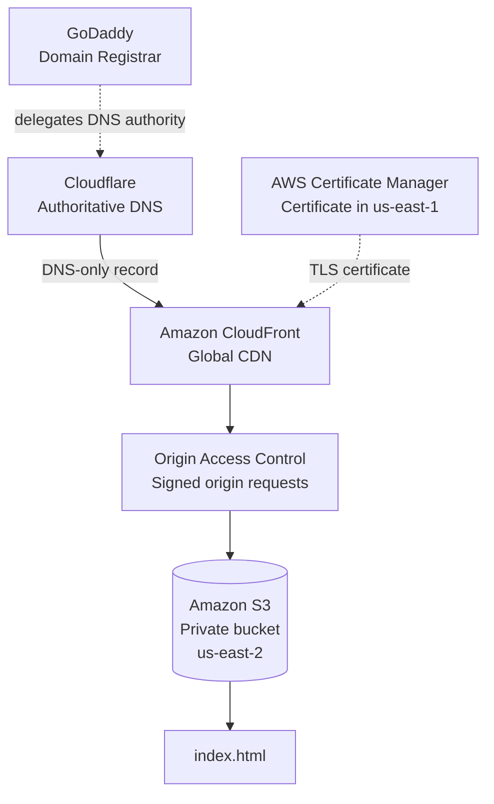

# Architecture

## Overview

The goal was to host `dague.vip` as a secure static portfolio without making the S3 bucket public.



## Responsibilities

### GoDaddy
GoDaddy remains the domain registrar. Registration and authoritative DNS are separate jobs.

### Cloudflare
Cloudflare is authoritative for DNS. The domain's nameserver delegation points to Cloudflare, which publishes the DNS records for `dague.vip`. Cloudflare's HTTP reverse proxy is **not** used for the website.

### Amazon CloudFront
CloudFront is the public delivery layer. It accepts HTTPS requests, serves cached content globally, maps `/` to `index.html`, and retrieves origin content from S3.

Configured alternate domain names:

- `dague.vip`
- `*.dague.vip`

### Amazon S3
The site files are stored in a private S3 bucket in `us-east-2`. Block Public Access is enabled and S3 static website hosting is disabled.

### Origin Access Control
OAC allows CloudFront to authenticate requests to S3. The bucket policy grants `s3:GetObject` to the CloudFront service principal and scopes access to the intended distribution.

### AWS Certificate Manager
The certificate covers:

- `dague.vip`
- `*.dague.vip`

It is stored in `us-east-1` for use with CloudFront.

## Request path

```text
Browser
  -> Cloudflare authoritative DNS
  -> Amazon CloudFront
  -> default root object: index.html
  -> OAC-signed S3 request
  -> private S3 object
  -> CloudFront cache
  -> Browser
```
